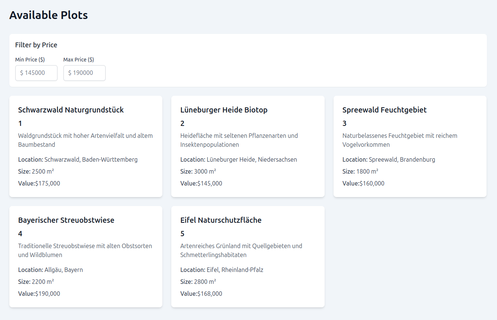

# Land Plots Dashboard

<div align="center">

<p align="center">
  <a href="https://www.greenaccount.com/" rel="noopener" target="_blank">
    
      </a>
</p>

[](https://react.dev/)
[](https://www.typescriptlang.org/)
[](https://remix.run/)
[](https://codecov.io/gh/arashmad/case-plots-remix-improvements)

</div>

<h1 align="center">Web Map Application - User Interface</h1>

**Land Plots Dashboard** A dashboard for managing land plots.

<div align="center">
    <p align="center">
        
    </p>
</div>

# Getting Started

#### Run the dev server:

```shell
npm run dev
```

## Deployment in production mode

First, build your app for production:

```shell
# build app
npm run build
# run in production mode
npm start
```

# Developed by

<p>
  <a href="https://www.greenaccount.com/" rel="noopener" target="_blank">
    
      </a>
</p>

Wir ermöglichen wirkungsvolle Investitionen in lokale und biodiverse Naturprojekte.

Noch stärker als heute werden Unternehmen in Zukunft an ihrem Einfluss auf Natur und Umwelt gemessen werden. Wir bieten die Mittel, um diesem Einfluss durch gezielte Investments in die Natur Rechnung zu tragen.

Auf kompensationsmarkt.de betreiben wir bereits heute einen erfolgreichen Marktplatz für Ökopunkte und Ausgleichsflächen. Dabei mitteln wir Unternehmen und Landowner, um Naturraum aufzuwerten.

Unser Motto: Invest in nature right next door!
